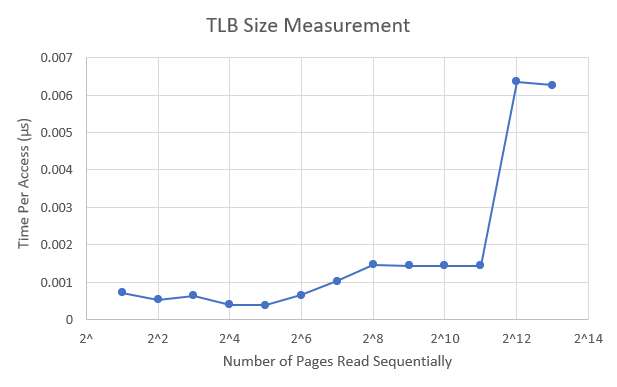

# Maxx Curtis - TLB measurment program
# Operating Systems - CSCI 393 Fall Semester - Reed College

The bash script I used to measure my results in included in this zip
file as "tlb.sh".
The number of trials decreases as NUMPAGES increases, because very 
low values (1, 8, etc...) require a ton of iterations to produce 
stable results, while high values, (near 2048) become detrimentally
slow at trial counts over 10,000.

When determining the number of trials for a given page count, I
started at 10,000,000, and reduced the number for each value
until the runtime became bearable to run. Afterward, several
iterations confirmed that the values were stable.

To ensure the compiler included each access, the values in the
array are determined pseudo-randomly at runtime, and the values
received from the array are summed and printed.

## Results:
| Pages: | Access Time (us): |
|--------|-------------------|
| 1 | 0.000711 |
| 2 | 0.000531 |
| 4 | 0.000635 |
| 8 | 0.000398 |
| 16 | 0.000382 |
| 32 | 0.000650 |
| 64 | 0.001022 |
| 128 | 0.001460 |
| 256 | 0.001439 |
| 512 | 0.001440 |
| 1024 | 0.001442 |
| 2048 | 0.006352 |
| 4096 | 0.006267 |

The above results are directly pulled from the terminal and have 
not been rounded. Additional tests (5 as of the last changes to 
the trial counts) were run to ensure the results are accurate to 
a resonable degree of variation.
(Two stable significant digits)

Notably, the lower-value tests are individually stable, but do not
increase in cost as NUMPAGES increases, nor are they roughly equal.
The average access time actually decreases as NUMPAGES increases,
until NUMPAGES = 32, when the access time takes a noticable leap.

When NUMPAGES = 32 or 64, the average access time is notably distinct
from the times above and below, which may suggest that the TLB
is having some effect. This inconsistentcy could be due to the working
set being larger than the primary tlb of a single CPU, but smaller than
the total primary tlb space on all cpus together. If the process were
swapped to different CPUs, it may find some values still in the new CPU
tlb, but if it remains on one CPU for a long while, it may begin 
missing consistently.

As far as I'm aware, the main thread of the process should be bound
randomly to a single cpu on the machine, but admittedly I'm unfamiliar
with the mechanisms for doing so.

Above 32, there are two distinct blocks of roughly equivalent
access times:
    128-1024:  ~0.0014
    2048-4096: ~0.0063

It seems that there is a small primary TLB that can hold 16 pages,
and a secondary TLB that holds up to 1024 pages.
